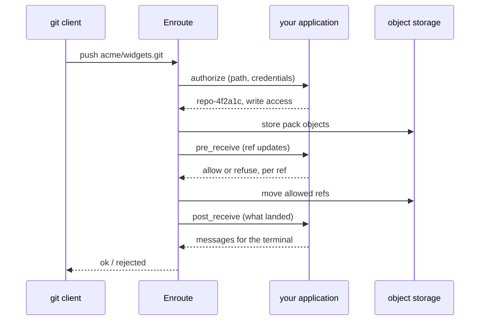

# Enroute

**Your repo, your rules.** Enroute is open-source, headless git infrastructure
built for agentic workloads. It terminates git client connections, stores
repositories in object storage, and calls your application back when it needs
a decision. Every rule and workflow is code you own, on infrastructure you run.

Code hosting is the last piece of the software stack still stuck in SaaS. No
settings pages, no YAML, no OAuth apps, no webhooks to reconcile: your
application answers four hooks and calls a gRPC API. That is the whole contract.

```sh
npx skills add enroute-sh/enroute             # give your coding agent the skills
docker pull ghcr.io/enroute-sh/enroute:latest # or run the image yourself
```

[Website](https://enroute.sh) ·
[Documentation](https://enroute.sh/docs) ·
[Thesis](https://enroute.sh/thesis) ·
[Hook reference](https://github.com/enroute-sh/enroute/blob/main/docs/reference/hooks.md)

**Built for:** agent code hubs · software factories · CI clones · embedded
versioning · GitHub gateways

## What it looks like

Protect `main` from direct pushes. Enroute stores the pushed objects, then asks
your application to judge each ref update before it moves anything:

```ts
// Adapted from docs/build/05-process-pushes.md
export async function preReceive(req: PreReceiveRequest) {
  return {
    judgements: req.commands.map((command) => ({
      refname: command.refname,
      ...(command.refname === "refs/heads/main"
        ? refuse("main is protected, open a merge request instead")
        : allow),
    })),
  };
}
```

What happens on `git push`:



Enroute is stateless. It needs PostgreSQL for metadata and an object store
(S3, Google Cloud Storage, or Azure Blob Storage) for everything else. There
are no disks to back up, no replicas to sync, and no shards to route.

## Start here

- [Quickstart](https://github.com/enroute-sh/enroute/blob/main/docs/quickstart.md) — a repository served in about ten minutes
- [Build a code hosting platform](https://github.com/enroute-sh/enroute/blob/main/docs/build/README.md) — from an empty project to code and diffs on a page, chapter by chapter
- [Patterns](https://github.com/enroute-sh/enroute/tree/main/docs/patterns) — protected branches, merge queues, CI on push, mirroring, deploy keys, and more
- [Concepts](https://github.com/enroute-sh/enroute/blob/main/docs/README.md#concepts) — the model, the hooks, and the storage, in four short pages

## Featured

- [enroute](https://github.com/enroute-sh/enroute) — the git backend, in Rust. Git smart HTTP, four hooks (`authorize`, `visible_refs`, `pre_receive`, `post_receive`), and a gRPC API. Published as `ghcr.io/enroute-sh/enroute`.

## Status

Enroute is **early**. We use it ourselves, but read the
[limitations](https://github.com/enroute-sh/enroute/blob/main/docs/reference/limitations.md)
and [security](https://github.com/enroute-sh/enroute/blob/main/docs/operate/security.md)
pages before you serve anything you care about. There is no backwards
compatibility between `0.x` releases.

Next on the roadmap: SSH and `git://` transports, fast checkout for agent
sandboxes, published benchmarks, and first-class [`git-meta`](https://git-meta.com/) support.

## Community

- Website: https://enroute.sh
- X: https://x.com/enroute_sh
- LinkedIn: https://www.linkedin.com/company/enroute-sh/
- Talk to a founder: https://cal.com/enroute · [founders@enroute.sh](mailto:founders@enroute.sh)

## Contributing

Pull requests are disabled. Send a `git format-patch` attachment to
[patches@enroute.sh](mailto:patches@enroute.sh). See
[How can I contribute?](https://github.com/enroute-sh/enroute#how-can-i-contribute)
for what we ask of a patch.

## License

Enroute is licensed under [Apache-2.0](https://github.com/enroute-sh/enroute/blob/main/LICENSE).
